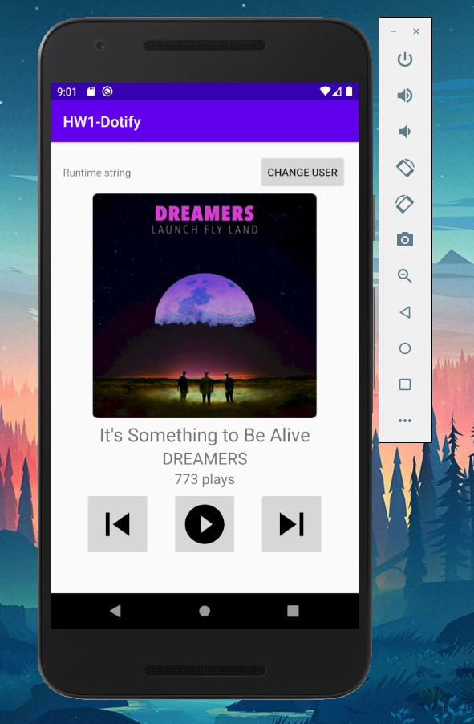

# Info 448 Homework 4 - Dotify 

## Patrin Sinteppadon

The fourth homework assignment of my Android development class. This project builds off of the initial streaming service project, now fetching the list of songs from an API by using Volley.

### WHAT'S NEW IN HW4:
 - Remember number of plays for each song using Application
 - Makes an HTTP request to an API using Volley
 - Converts results of JSON into Song objects using GSON
 - Bind images using Picasso.

### Extra credits attempted
I did not attempt extra credits for this homework.

